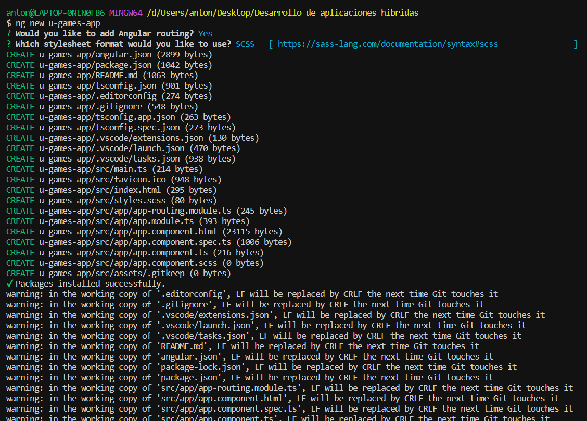
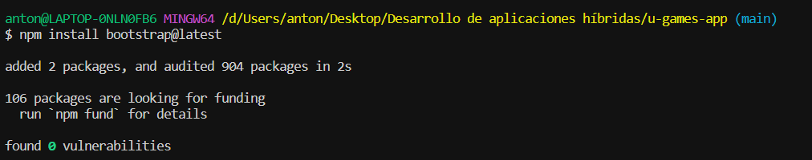
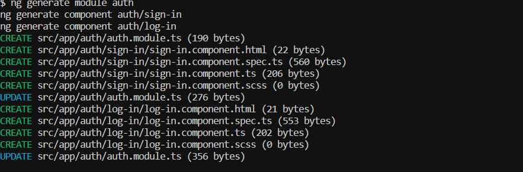
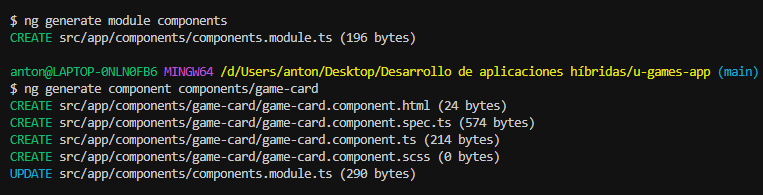
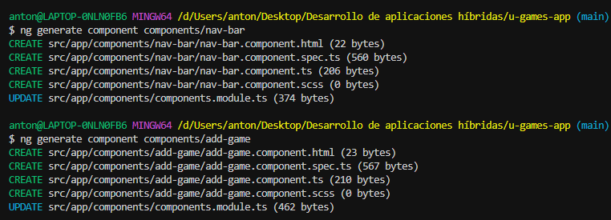
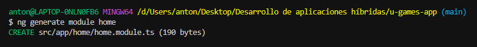
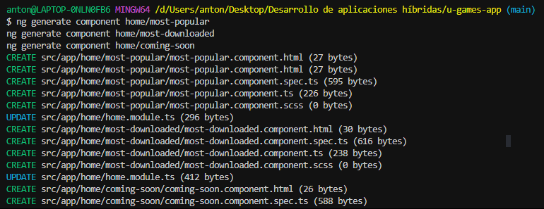
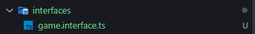
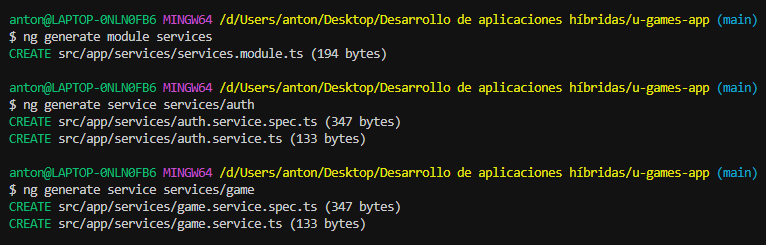

Comienzo creando el proyecto de Angular:

Instalamos bootstrap para la estilizacion:

Agregamos bootstrap a la configuración en angular.json:

"styles": [
  "src/styles.css",
  "node_modules/bootstrap/dist/css/bootstrap.min.css"
]

Creación de los módulos

Modulo de autenticación:

Módulo de componentes con sus respectivos componentes:

Módulo Home con sus respectivos componentes:

Interfaces:

Servicios:

